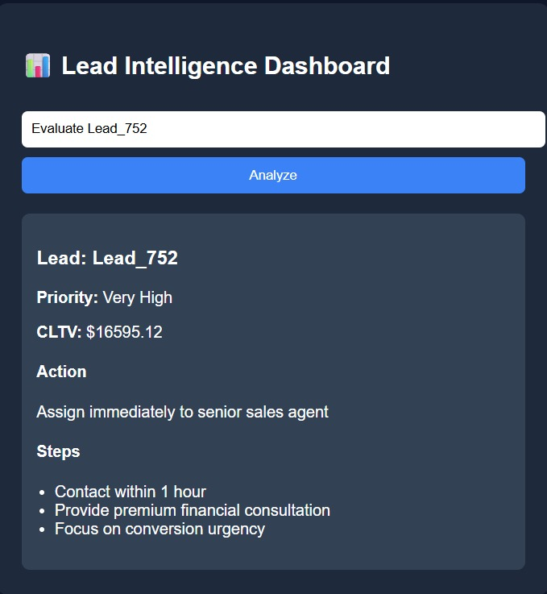
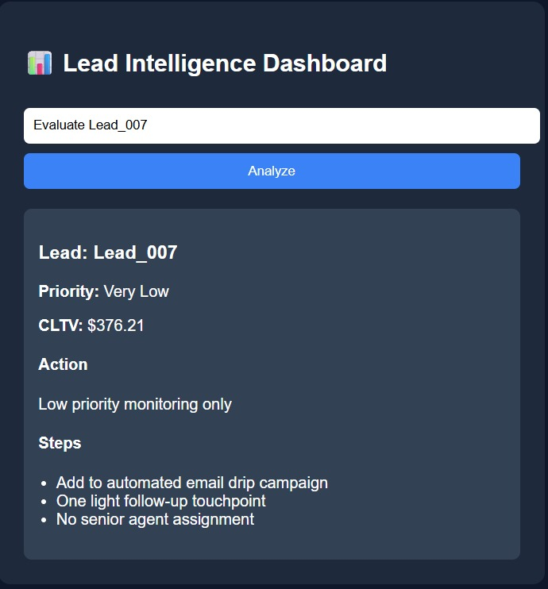
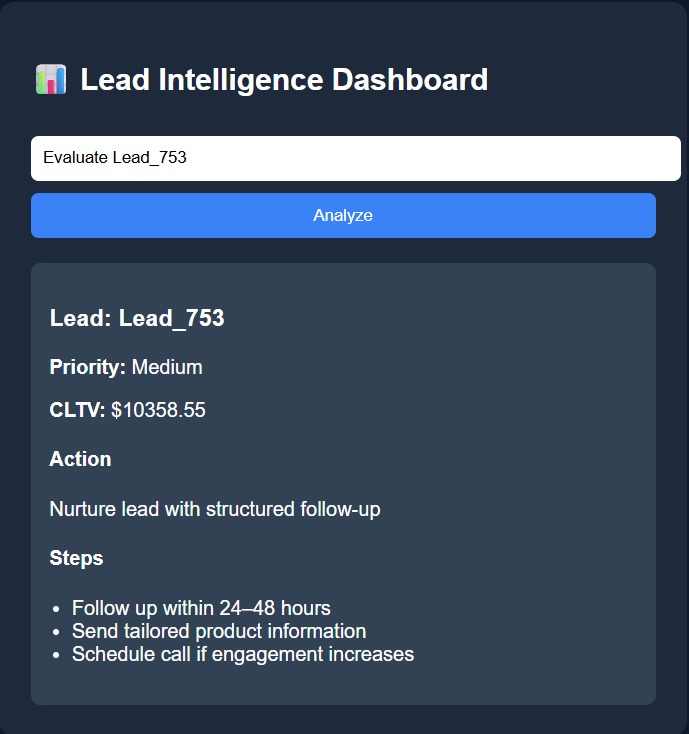
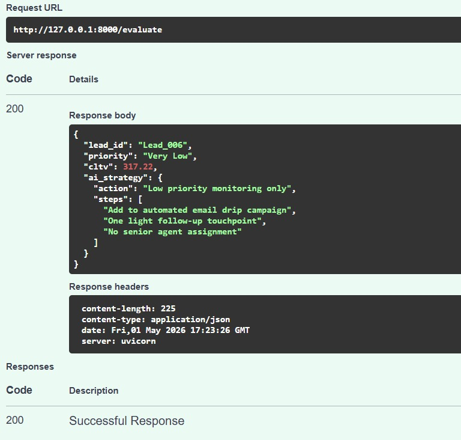

# 🏦 Bank Lead Intelligence System

An end-to-end AI-powered system designed to evaluate and prioritize customer leads using Machine Learning and business-driven decision logic.

---

## 🚀 Overview

This project simulates a real-world banking/fintech use case where customer leads are analyzed and scored based on their potential value.

The system predicts:
- Customer Lifetime Value (CLTV)
- Lead Priority

And generates:
- Actionable recommendations
- Execution steps for sales teams

---

## 🧠 Key Features

- 📊 CLTV Prediction using Machine Learning
- 🎯 Lead Priority Classification
- ⚙️ Rule-based Decision Engine (Production-style logic)
- 🌐 FastAPI Backend
- 🖥️ Interactive Frontend Dashboard
- 🔄 End-to-End System Integration

---

## 🏗️ System Architecture


User Input (UI)
↓
Frontend (HTML + JS)
↓
FastAPI Backend (/evaluate)
↓
Lead Data Retrieval (CSV)
↓
ML Models (CLTV + Priority)
↓
Decision Engine (Rule-Based)
↓
JSON Response
↓
Frontend Display


---

## 🛠️ Tech Stack

- Python
- Pandas
- Scikit-learn
- FastAPI
- HTML / CSS / JavaScript
- Git & GitHub

---

## ▶️ How to Run the Project

### 1. Clone the repository

```bash
git clone https://github.com/aceyourgrace/AI-Customer-Onboarding-Policy-Intelligence-Platform.git
cd bank-lead-intelligence

2. Activate virtual environment
venv\Scripts\activate

3. Install dependencies
pip install -r requirements.txt

4. Run the API server
uvicorn src.api.mainapi:app --reload

5. Open in browser
http://127.0.0.1:8000

📊 Example Input
Evaluate Lead_006
📈 Example Output
Lead ID
Priority Level
CLTV
Recommended Action
Execution Steps

🧠 Design Approach
This system follows a hybrid AI architecture:

Machine Learning → Prediction (CLTV, Priority)
Rule-Based Logic → Decision Making

This ensures:
Reliability
Consistency
Business alignment

⚠️ Note on LLM Usage

Initial experiments were conducted using LLMs for decision generation.

However, due to:
inconsistent outputs
lack of control
unpredictability

The final system uses a deterministic decision engine, which is more aligned with real-world financial systems.

🔮 Future Enhancements:
LLM-based explanation layer
Advanced analytics dashboard
Cloud deployment
Real-time data integration

## 📸 Screenshots

### 🖥️ Dashboard UI




### 📊 API Response (Swagger)


### 📊 Processed Leads with CLTV and Priority


👨‍💻 Author
Bikesh Chipalu
(AceYourGrace)


---